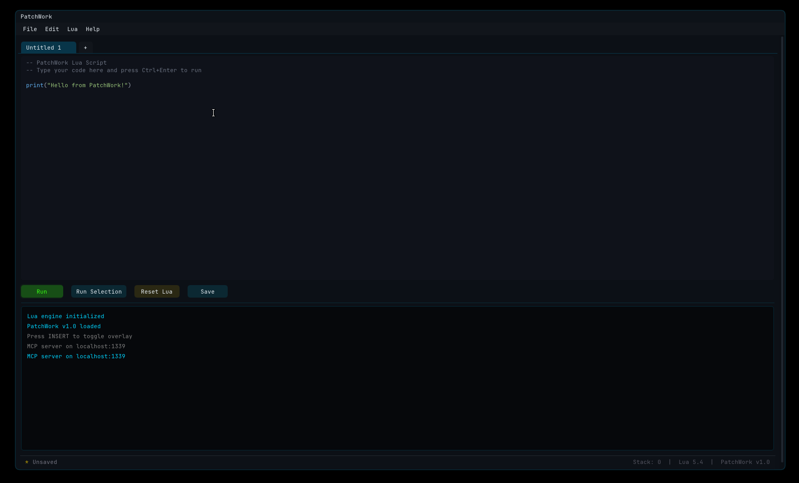

# PatchWork [](https://github.com/dzxpert/PatchWork/actions/workflows/msbuild.yml)


An injectable x64 DLL featuring an in-process Lua engine and built-in MCP server for runtime memory patching, code hooking, and AI-driven process manipulation.

## Features



### Hooking functions

Replaces a function at a given address with a Lua callback. The callback receives the original arguments and can optionally call through to the original.

```
hookCode(luaHookCallback, address, argumentCount, callingConvention, hookSize)
  Returns: the original function
```

#### Example

```lua
function functionA_hook(arg1, arg2, arg3)
    local result = functionA_original(arg1, arg2, arg3)
    if result == 1 then result = 0 end
    return result
end

functionA_original = hookCode(functionA_hook, 0x1400ABCDE, 3, 0, 14)
```

### Exposing functions to Lua

Makes a native function callable from Lua.

```
exposeCode(address, argumentCount, callingConvention)
  Returns: a callable function
```

#### Example

```lua
functionA = exposeCode(0x1400ABCDE, 3, 0)

local result = functionA(0x12345ABC, -1, 99)
```

### Detouring code

Redirects execution to a Lua callback at a given address. The callback receives a register table (`RAX`–`R15`) and must return it (optionally modified).

```
detourCode(luaCallback, address, size)
```

#### Example

```lua
function onDetour(registers)
    registers.RAX = 1
    return registers
end

detourCode(onDetour, 0x1400ABCDE, 14)
```

### AOB scanning

```
scanForAOB(searchPattern[, min, max])
  searchPattern: hex string with ? wildcards, e.g. "FF A1 E? B? ?? 00"
  Returns: address or nil
```

### Memory functions

All memory read, write, copy, and set APIs are wrapped in **Structured Exception Handling (SEH)** guards. If an invalid or unallocated address is accessed, the game/process will not crash; instead, it raises a clean Lua runtime error.

Every API function supports both **camelCase** (e.g. `readByte`) and **PascalCase** (e.g. `ReadByte`) globally.

```
allocate(size)           -- allocate data memory
allocateCode(size)       -- allocate executable memory
readBytes(address, n)    -- returns table of n bytes
writeBytes(address, data)
readString(address)      -- null-terminated ASCII
readInteger(address) / writeInteger(address, value)
readQword(address) / writeQword(address, value)     -- read/write 64-bit pointers (QWORDs)
readSmallInteger(address) / writeSmallInteger(address, value)
readByte(address) / writeByte(address, value)
copyMemory(dst, src, n)
setMemory(address, value, n)
writeCode(address, bytes)
```

### Library functions

```
loadLibraryA(name)
getLibraryProcAddressA(module, name)
getProcAddress(name)
getAddress([name])        -- returns base address of name (or main module if nil/omitted)
```

## Overlay

After injection, press **INSERT** to toggle the ImGui overlay.

- **Console tab** — Lua REPL with colored output; `print()` routes here
- **Scripts tab** — editor with file open/save, tab management, and session persistence
- **Ctrl+Enter** — run the current script
- Scripts and sessions stored under `C:\PatchWork\scripts\`

## MCP Server (Model Context Protocol)

PatchWork includes a built-in, lightweight JSON-RPC 2.0 TCP server compatible with the Model Context Protocol (MCP). This enables external AI agents, Python scripts, or custom IDEs to control the target process, execute Lua scripts on the main thread, and inspect the state dynamically.

### Core Features

- **Safe Main-Thread Execution**: Executes incoming Lua payloads inside the target process's rendering loop (`hkPresent`), avoiding multithreading crashes.
- **Port Fallback Range (`1339–1348`)**: Binds to `1339` by default. If the port is in use (e.g., from an older active injection), it automatically tries consecutive ports up to `1348`.
- **DebugView Diagnostics**: All server events (startup, binds, connections, payloads, disconnects) are logged via `OutputDebugStringA` with the prefix `[PW-MCP]`.
- **Interactive Python Helper**: `tools/patchwork_mcp.py` provides a shell console and programmatic interface.

### Running the Python Helper

To start an interactive command-line interface:

```powershell
python tools/patchwork_mcp.py
```

### Protocol & API Reference

All requests and responses follow standard line-delimited JSON-RPC 2.0 over TCP.

#### `execute_lua`
Run a Lua script on the main render thread. If the code calls `print()`, the printed outputs are captured and returned.
* **Request**: `{"jsonrpc": "2.0", "method": "execute_lua", "params": {"code": "print('hello from python')"}, "id": 1}`
* **Response**: `{"jsonrpc": "2.0", "result": {"content": [{"type": "text", "text": "hello from python"}]}, "id": 1}`

#### `get_status`
Retrieve current system health, console size, and state.
* **Request**: `{"jsonrpc": "2.0", "method": "get_status", "id": 1}`
* **Response**: `{"jsonrpc": "2.0", "result": {"console_lines": 5, "lua_state": "active", "mcp_server": "running", "overlay_visible": true}, "id": 1}`

#### `get_console`
Get the text content of the in-game ImGui console.
* **Request**: `{"jsonrpc": "2.0", "method": "get_console", "id": 1}`
* **Response**: `{"jsonrpc": "2.0", "result": {"lines": ["Line 1", "Line 2"]}, "id": 1}`

#### `clear_console`
Clear all text in the in-game ImGui console.
* **Request**: `{"jsonrpc": "2.0", "method": "clear_console", "id": 1}`
* **Response**: `{"jsonrpc": "2.0", "result": {"success": true}, "id": 1}`

## Agentic MCP Server Integration

To connect external AI agents (such as Claude Desktop, Cursor, or Gemini) directly to a running game/process via PatchWork, you can configure the stdin/stdout MCP server bridge:

### 1. Configure the Bridge

Add the following configuration to your AI client's settings:

```json
{
  "mcpServers": {
    "patchwork": {
      "command": "python",
      "args": ["c:/Users/xWantedStore/Documents/GitHub/PatchWork/tools/patchwork_agent_mcp.py"]
    }
  }
}
```

### 2. Available Agent Tools

Once configured, the agent will have native access to the following tools in their chat console:
- `execute_lua(code)`: Runs Lua commands on the main thread and returns output.
- `get_base_address([module_name])`: Resolves 64-bit module base addresses (e.g. `StarCitizen.exe`).
- `read_memory(address, type, [length])`: Reads `byte`/`short`/`integer`/`string` from 64-bit space.
- `write_memory(address, type, value)`: Writes values to a 64-bit memory address pointer.
- `scan_aob(pattern)`: Locates static signatures in memory dynamically.
- `get_console([count])`: Reads the latest in-game ImGui console lines.

### 3. Agent Playbook & Instructions

For detailed instructions on AOB scans, pointer traversal, detour registration, and safe hooks, see the [Agent Playbook](file:///c:/Users/xWantedStore/Documents/GitHub/PatchWork/tools/skills/patchwork/SKILL.md).

## Building

Requires Visual Studio 2022 (toolset v143) with the MASM build customization installed.

```
msbuild /m /p:Platform=x64 /p:Configuration=Debug   PatchWork.sln
msbuild /m /p:Platform=x64 /p:Configuration=Release PatchWork.sln
```

NuGet packages and submodules are restored automatically on first build.
